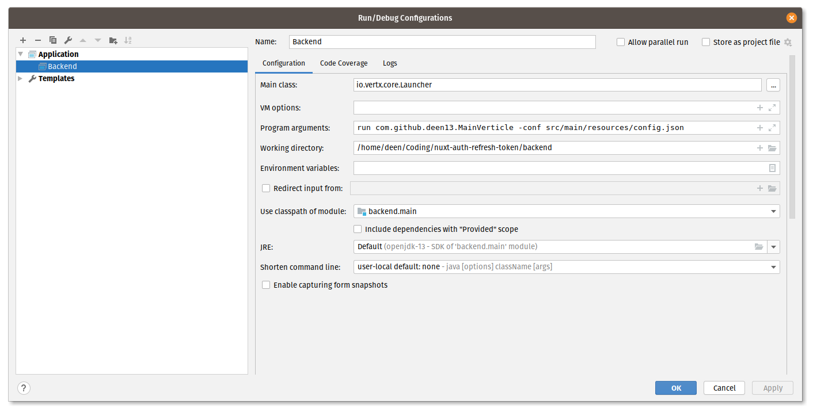

# :bullettrain_side: Vert.X and Nuxt.js

This project is a demonstration of nuxt.js and vert.x in combination.

### Goals
- [Pull Request Collaboration](https://github.com/nuxt-community/auth-module/pull/361)
- [Live Coding](https://docs.google.com/presentation/d/15aMY8K4o9OtPjzwQw8lvP6Y628AETMjLxz0l52cC8c0/edit?usp=sharing)

### Backend 

#### Development Setup


#### Docker Setup
```bash
# build docker image
$ ./gradlew jibDockerBuild

# serve backend
# the config is embedded to ease the setup but should be mounted in production builds
$ docker run -p 127.0.0.1:8080:8080 backend run com.github.deen13.MainVerticle -conf /app/resources/config.json
```

### Frontend
```bash
# install dependencies
$ yarn

# serve with hot reload at localhost:3000
$ yarn dev
```

### Credentials
:woman: Username: admin </br>
:key: Password: github
